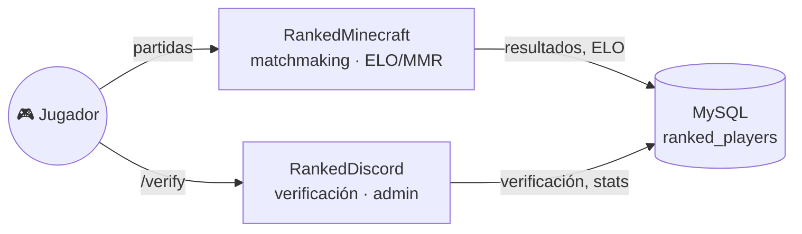

<div align="center">

# 💬 RankedDiscord

**Puente entre tu servidor de Minecraft y Discord.**
Verificación de cuentas, comandos de administración, bienvenidas — el complemento social de [RankedMinecraft](https://github.com/FabricioYV/RankedMinecraft).

[](LICENSE)
[](pom.xml)
[](https://github.com/FabricioYV/RankedMinecraft)
[](https://github.com/discord-jda/JDA)

[Instalación](#-instalación) • [Comandos](#-comandos) • [Configuración](#%EF%B8%8F-configuración) • [Sistema completo](#-parte-de-un-sistema)

</div>

---

## ✨ Qué hace

| | |
|---|---|
| 🔗 **Verificación** | `/verify` en el juego vincula la cuenta de Minecraft con Discord por código |
| 🛡️ **Admin vía Discord** | Ajustar ELO/wins/losses o resetear estadísticas sin tocar la base de datos a mano |
| 👋 **Bienvenidas** | Mensaje personalizable al primer join de cada jugador |
| ℹ️ **Info del servidor** | Comandos de prefijo (`!ip`, `!info`, `!instrucciones5v5`, `!instrucciones8v8`, `!stats`) totalmente configurables |

## 🧩 Parte de un sistema

RankedDiscord no funciona solo — es el complemento de **[RankedMinecraft](https://github.com/FabricioYV/RankedMinecraft)**, que corre en el servidor y maneja matchmaking, picks y cálculo de ELO/MMR. Ambos plugins leen y escriben **la misma tabla `ranked_players`** en una única base de datos MySQL.



**👉 Para instalar el sistema completo (los dos plugins + la base de datos compartida), seguí [SETUP.md](https://github.com/FabricioYV/RankedMinecraft/blob/master/SETUP.md)** en el repo de RankedMinecraft.

## 🚀 Instalación

```bash
git clone https://github.com/FabricioYV/RankedDiscord.git
cd RankedDiscord
mvn clean package
```

Copiá el `.jar` de `target/` a `plugins/`, iniciá una vez para generar `config.yml`, apagalo y completalo (ver abajo). Si dejás algún campo con su placeholder `PUT_..._HERE` de fábrica, el plugin te avisa en consola exactamente qué falta y se deshabilita solo, en vez de fallar con errores confusos de conexión.

## ⚙️ Configuración

| Clave | Qué es |
|---|---|
| `database.host/port/database/username/password` | La **misma base de datos** que usa RankedMinecraft |
| `discord.token` | Token del bot (Discord Developer Portal) |
| `discord.queue_role_name` | Nombre del rol `@Queue` en tu servidor |
| `discord.super-admin-user-id` | Tu ID de Discord, único autorizado para `/resetallstats` |
| `server.name` / `server.ip` | Nombre e IP mostrados en `!ip` / `!info` |
| `server.ip-5v5` / `server.ip-8v8` | IPs específicas por modo, usadas en las instrucciones |
| `commands.ranked` / `commands.mixed` | Comandos que le decís al jugador para unirse a cada modo |

## 📜 Comandos

**En el juego**

| Comando | Descripción |
|---|---|
| `/verify` | Genera un código para vincular tu cuenta con Discord |
| `/setwelcome <mensaje>` | Personaliza tu mensaje de bienvenida (si sos elegible) |

**En Discord (prefijo `!`)**

| Comando | Descripción |
|---|---|
| `!ip`, `!info` | Info y IP del servidor |
| `!instrucciones5v5`, `!instrucciones8v8` | Instrucciones por modo |
| `!donacion` / `!donar` / `!paypal` / `!apoyo` | Info de donaciones |
| `!stats <jugador>` | Estadísticas de un jugador |

**Admin (Discord, requiere `discord.super-admin-user-id`)**

Ajuste manual de ELO/wins/losses y `/resetallstats`.

## 📄 Licencia

[GPL-3.0](LICENSE) — Creado por [FabricioYV](https://github.com/FabricioYV).
